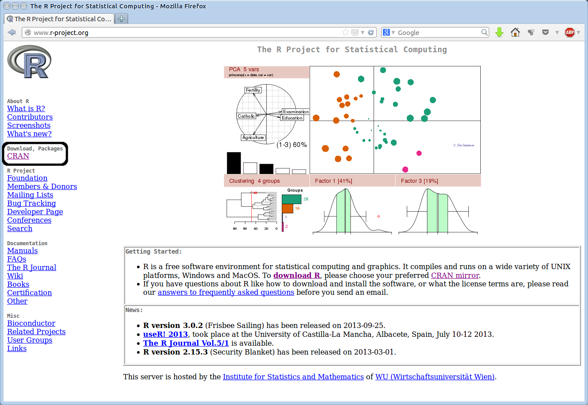
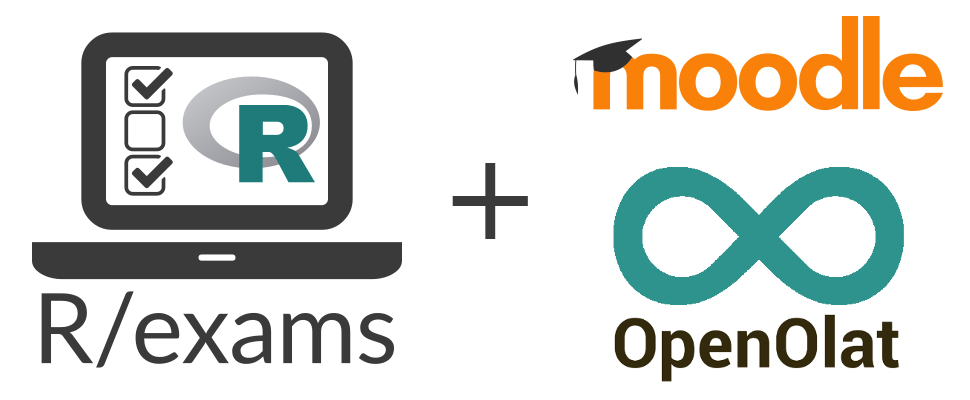

<!--
https://brentthorne.github.io/posterdown_html_showcase/
{width=40%}
-->


```{r, include=FALSE}
knitr::opts_chunk$set(echo = FALSE,
                      warning = FALSE,
                      tidy = FALSE,
                      message = FALSE,
                      fig.align = 'center',
                      out.width = "100%")
options(knitr.table.format = "html") 
```


```{r, include=FALSE}
#knitr::write_bib(c('posterdown', 'rmarkdown','pagedown'), 'packages.bib')
knitr::write_bib(file = 'packages.bib')

```


# Objetivo {width=7%}

###  Elaboración de materiales didácticos completos en diversos formatos ad-hoc para la asignatura de Estadística

 La metodología propuesta se puede utilizar para cualquier tipo de asignatura, aunque en aquellas con un componente cuantitativo es donde se puede aprovechar al máximo. {width=5%}

#  Un enfoque repoducible y automatizada  {width=7%} 

Se propone la utilización del software estadístico [R](https://cran.r-project.org/) y la interfaz  [RStudio](http://www.rstudio.com) para la generación de materiales didácticos aplicando el enfoque de investigación reproducible a la docencia. 

<p align="center">
{width=95%}
</p>

Todo el contenido del material se encuentra en ficheros de texto plano que incluye fragmentos de código con el que se leen datos, se realizan cálculos y se generan tablas y gráficos. 

El fichero de texto se compila de la forma adecuada, y el resultado son los materiales listos para usar por los alumnos. Cada vez que se compila el documento, los fragmentos de código se ejecutan y su resultado se actualiza en el documento de salida. 

Esto permite realizar fácilmente cambios y que se reflejen automáticamente en todas las versiones de la documentación.  


## Bases para la creación de documentos multiformato {width=7%} 

Mediante **markdown** se puede generar documentación fácilmente reproducible y modificable con poca o nula experiencia en programación. La siguiente figura resume todo el proceso.

{width=105%} 
$~$

$~$


# Creación de libros  con 

### {width=38%}

Bookdown es un paquete de R que permite crear libros, artículos o apuntes de alta calidad mediante sintaxis Markdown. 

Una vez creada la estructura del documento bookdown, este se puede compilar en varios formatos: HTML, EPUB (para lectores electrónicos) y PDF.

Con estas bases, una colección de materiales didácticos a elaborar para una asignatura podría constar
de:

* Apuntes, presentaciones y problemas. Los apuntes con bookdown quedan en formato libro, pero
también accesible para cualquier dispositivo (móvil, tablet). 

* El paquete bookdown es un paquete R de código abierto que facilita la escritura de libros y artículos/informes extensos con R Markdown. Las características incluyen:

*  Múltiples opciones de formatos de salida:

{width=25%}
{width=15%}
{width=15%}
{width=15%}
{width=15%}


* Posibilidad de incluir gráficos dinámicos y aplicaciones interactivas (widgets HTML y apps Shiny).

* Admite una amplia gama de lenguajes: R, C/C++, Python, Fortran, Julia, scripts de Shell y SQL, etc.

<!--* Las ecuaciones, teoremas y demostraciones de LaTeX funcionan para todos los formatos de salida.
-->

*  Se puede publicar en GitHub, bookdown.org y cualquier servidor we, por ejemplo 
Ejemplos: apuntes básicos (introdución a la estadística con R](https://rubenfcasal.github.io/intror/)  y avanzdos de estadística  [Aprendizaje Estadístico](https://rubenfcasal.github.io/aprendizaje_estadistico/)[Apuntes para el aprendizje estadístico].

<!--
{width=40%}
{width=40%}
-->


## Crea tu sitio web o blog con {width=40%}

El objetivo de este paquete es proporcionar un **blog** (sitio web potente y personalizable) donce subir su  material docente. 

* Permite mostrar salidas automáticas, como gráficos, tablas y resultados de análisis, y
elementos de escritura técnica como citas, notas a pie de página, etc.

* Alternativa gratuita a programas de pago.


## Crear tu  póster (como éste) con

<p align="center">
{width=20%}


**Ciencia abierta**:, esta jornada permite el feedback de la comunidad científica. Toda la información de esté póster está disponible en Git {width=4%} [enlace documentación poster](https://github.com/moviedo5/XIGAID)


# Crea tu aplicación web  con

<p align="center">
{width=35%}
</p>

<!--
No solo se pueden crear scripts de R para análisis estadístico, sino que también permite la creación de documentación en formatos HTML, LaTeX y Markdown con  la ventaja de la calidad y versatilidad de los resultados de salida. -->

Aplicaciones web (dinámica e interactivas) encillas para ciencia de datos sin compromisos.  Ejemplos: [Radiant](https://shiny.posit.co/r/gallery/education/radiant/), paneles para difundir resultados como: [Predición cooperativa del COVID](https://covid19.citic.udc.es/). Además, no se requieren habilidades de desarrollo web, ver ejemplo:

<p align="center">
{width=80%}
</p>


<!--
* Alternativa gratuita a programas de  (Excel, SPSS, etc.pago). 

[R Commander](https://estadistica-dma.ulpgc.es/cursoR4ULPGC/12-Rcommander.html)
-->


<!--
{width=75%}
-->


## Creacion de cuestionarios Moodle


<p align="center">
{width=70%}
</p>


El paquete de R de código abierto **Rexams** ofrece un enfoque único para la generación automática de exámenes. Basado en plantillas de ejercicios, es posible crear grandes cantidades de exámenes, cuestionarios y pruebas personalizadas para diversos sistema (con evaluación automática) e importaciones a sistemas de gestión del aprendizaje (como Moodle o Canvas).

<!--
<p align="center">
{width=50%}
</p>
-->


<!--
Cuestionarios de aprendizaje para Moodle
{width=40%}
Falta logo jornadas
-->


### Agradecimientos

\footnotesize
_Esta investigación/trabajo fue apoyado por las ayudas MINECO, PID2020-113578RB-I00 MTM2017-82724-R  y por la Xunta de Galicia (Grupos de Referencia Competitiva ED431C-2020-14 y Centro de Investigación del Sistema universitario de Galicia ED431G 2019/01), todos ellos a través del FEDER. CITIC, está financiado por la "Consellería de Cultura, Educación e Universidade de la Xunta de Galicia._

### Referencias

R Core Team. R: A language and environment for statistical computing. R Foundation for Statistical
Computing (2017), Vienna, Austria. U

Yihui Xie. bookdown: Authoring Books and Technical Documents with R Markdown. Chapman
and Hall/CRC (2017). 

<!--

Introducción al Análisis de Datos con R

Rubén Fernández Casal (ruben.fcasal@udc.es)

Javier Roca-Pardiñas (roca@uvigo.es)

Julián Costa Bouzas (julian.costa@udc.es)

Manuel Oviedo de la Fuente (manuel.oviedo@udc.es)

Edición: Junio de 2022. Impresión: 2023-02-13. ISBN: 978-84-09-41823-7

 I Xornada Interuniversitaria Galega de Innovación Docente (XIGAID)
-->

